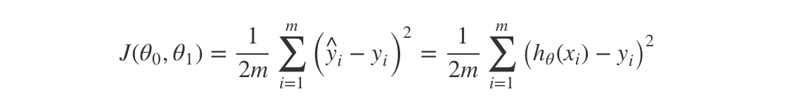
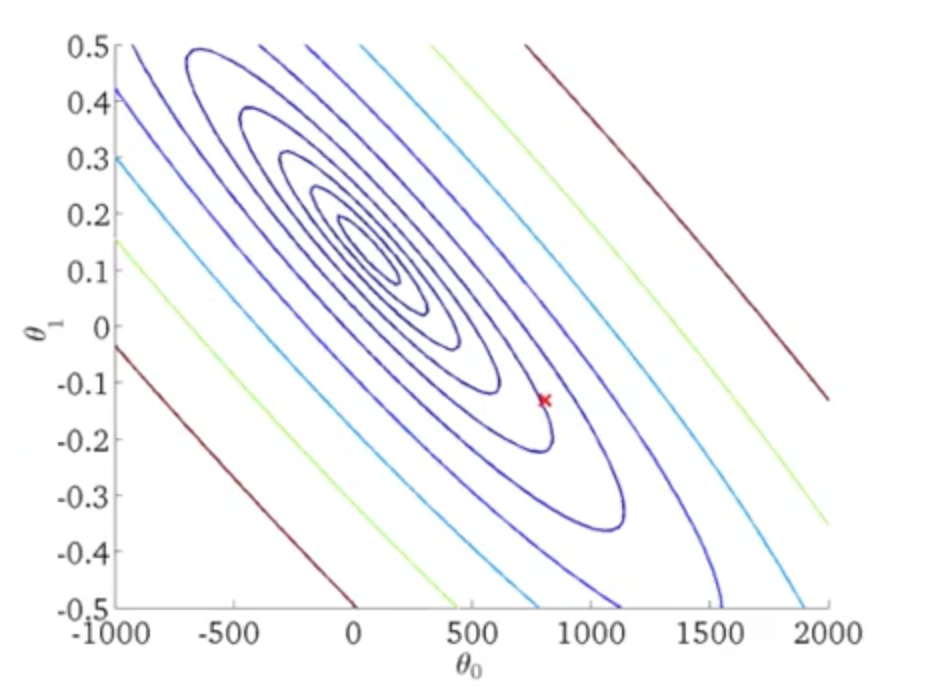
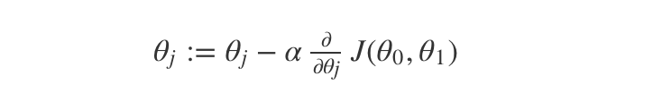
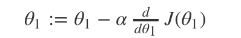
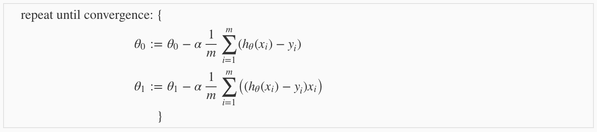

# Introduction

## What is Machine Learning

### Machine Learning Definition

- Arthur Samuel (1959). Machine Learning: Field of study that gives computers the ability to learn without being explicitly programmed.

  P.S. Arthur Samuel is not a good chess player himself.

- Tom Mitchell (1998) Well-posed Learning Problem: A computer program is said to learn from experience E with respect to some task T and some performance measure P, if its performance on T, as measured by P, improves with experience E. 

###Machine Learning Algorithms

- Supervised Learning
- Unsupervised Learning

##Supervised Learning

- 'right answer' given for each example of the data set

- applied to **Regression** or **Classification**

  - Regression

    continuos valued output

  - Classification

    discrete valued output

## UnSupervised Learning

- without the 'right answers'

- break data into different clusters

- application

  - google news
  - understanding genomics
  - organize computer clusters
  - social network analysis
  - maket segementation
  - astronomical data analysis

- Cocktail party problem

  figure out different sound source

P.S. use Octave

# Model and Cost Function

##Model Representation

- linear regression

  linear regression with a single variable is called a univariate linear regression

To describe the supervised learning problem slightly more formally, our goal is, given a training set, to learn a function ***h : X → Y*** so that ***h(x)*** is a “good” predictor for the corresponding value of ***y***. For historical reasons, this function ***h*** is called a hypothesis. Seen pictorially, the process is therefore like this:

## Cost Function

We can measure the accuracy of our hypothesis function by using a **cost function**. In a univariate linear regression problem, cost function can be denoted as below:

## Cost Function Intuition

J function of theta-1 (theta-0 = 0, this is a simplified way) has a shape of a bowl(actually, it is a parabola). 

You can use **Contour Plots**(or Contour figures) to denote ***J(θ0, θ1)***.

# Parameter Learning

## Gredient Descent

Gredient descent is a algorithm to compute the minimum combination of *θ1* and *θ0*. It can be denoted as below:

`:=`means assignment. ***α*** is the step to down the hills. The direction in which the step is taken is determined by the partial derivative of ***J(θ0,θ1).*** ***α***(is called learning) determines the step and the derivative term determines  the direction.

P.S. ***θ0*** and ***θ1*** can be initialize to any value.

## Gredient Descent Intuition

We explored the scenario where we used one parameter ***θ1*** and plotted its cost function to implement a gradient descent. Our formula for a single parameter was :

Repeat until convergence:

- If ***α*** is too small, gredient descent can be slow
- if ***α*** is too large, gredient can overshoot the minimum. It may fail to converge, or even diverge

As we approach local minimum, gredient descent will automatically take smaller steps. So no need to decrease ***α*** over time.

## Gradient Descent For Linear Regression

In this case, we can substitute our actual cost function and our actual hypothesis function and modify the equation to :

- batch gradient decient

  This method looks at every example in the entire training set on every step.

- linear regression will always converge

  For linear regression has no local optima, If the  ***α*** is not too large, it will always converge.

