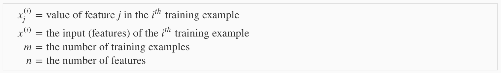
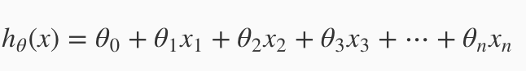
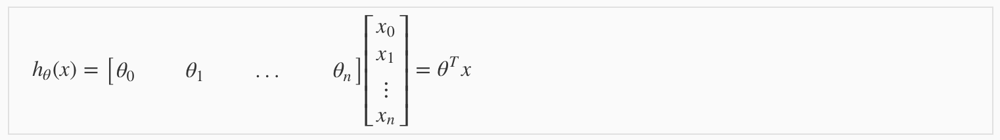
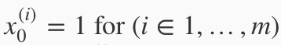
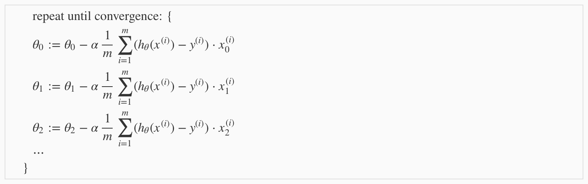
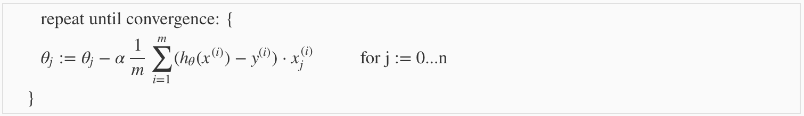
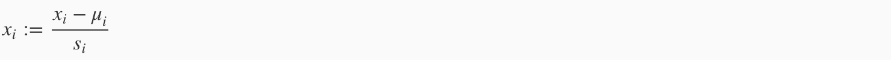
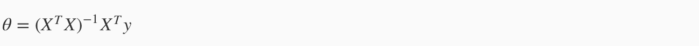

# Linear Regression with Multiple Variables

## Environment Setup Instructions

I choosed Octave as my tool.

## Multivariate Linear Regression

### Multiple Features

We now introduce notation for equations where we can have any number of input variables.

In that case, we have a new equation for hypothesis:

see also:

for convenience, we assume:

### Gradient Descent For Multiple Variables

The gradient descent equation itself is generally the same form; we just have to repeat it for our 'n' features:

In other words:

### Gradient Descent in Practice I - Feature Scaling

We can speed up gradient descent by having each of our input values in roughly the same range. Two techniques to help with this are **feature scaling** and **mean normalization**. To implement both of these techniques, adjust your input values as shown in this formula:

Where μi is the **average** of all the values for feature (i) and si is the range of values (max - min), or si is the standard deviation.

### Gradient Descent in Practice II - Learning Rate

**Note:** [5:20 - the x -axis label in the right graph should be *θ* rather than No. of iterations ]

**Debugging gradient descent.** Make a plot with *number of iterations* on the x-axis. Now plot the cost function, *J(θ)* over the number of iterations of gradient descent. If *J(θ)* ever increases, then you probably need to decrease *α*.

**Automatic convergence test.** Declare convergence if *J(θ)* decreases by less than *E* in one iteration, where *E* is some small value such as 10−3. However in practice it's difficult to choose this threshold value.

To summarize:

If *α* is too small: slow convergence.

If *α* is too large: may not decrease on every iteration and thus may not converge.

### Features and Polynomial Regression

We can **combine** multiple features into one. For example, we can combine *x1* and *x2* into a new feature *x3* by taking *x1⋅x2*.

**Polynomial Regression**

## Computing Parameters Analytically

### Normal Equation

The normal equation formula is given below:

There is **no need** to do feature scaling with the normal equation.

The following is a comparison of gradient descent and the normal equation:

| Gradient Descent             | Normal Equation                          |
| ---------------------------- | ---------------------------------------- |
| Need to choose alpha         | No need to choose alpha                  |
| Needs many iterations        | No need to iterate                       |
| *O (kn2)*                    | *O (n3)*, need to calculate inverse of *XTX* |
| Works well when *n* is large | Slow if *n* is very large                |

With the normal equation, computing the inversion has complexity (n3). So if we have a very large number of features, the normal equation will be slow. In practice, when n exceeds 10,000 it might be a good time to go from a normal solution to an iterative process.

### Normal Equation Noninvertibility

When implementing the normal equation in octave we want to use the 'pinv' function rather than 'inv.' The 'pinv' function will give you a value of θ even if XTX is not invertible.

If XTX is **noninvertible,** the common causes might be having :

- Redundant features, where two features are very closely related (i.e. they are linearly dependent)
- Too many features (e.g. m ≤ n). In this case, delete some features or use "regularization" (to be explained in a later lesson).

Solutions to the above problems include deleting a feature that is linearly dependent with another or deleting one or more features when there are too many features.